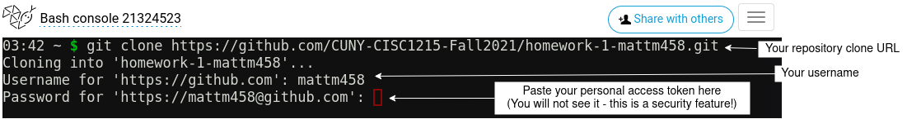
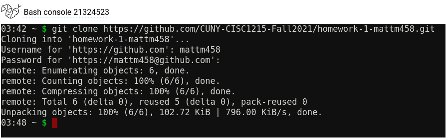

# Homework/Lab 1 (10 points)
Due Sunday, February 6 at 11:59 PM

## Git setup

The purpose of this assignment is to familiarize you with Git, GitHub, and Python. It will walk you through the process of creating and checking out your homework repository, doing your work, and uploading your code.

It assumes you have an account on [GitHub](https://github.com) and [PythonAnywhere](https://www.pythonanywhere.com).

If you do not have prior experience with Git, many of these steps will seem like extra work. However, over the semester, we will gradually expand our understanding of Git and GitHub, and we will learn about some of its more advanced and useful features. This document is a starting point that we will build on.

### Prerequisites
For a primer on Git and GitHub concepts, you can refer to the Lecture 2.5 slides in Blackboard.

#### Access Token
Github requires you to authenticate yourself when retrieving code from your private repositories, and most homework will be stored in a private repository. For now, we will use __personal access token authentication__. You must set up a personal access token in GitHub to use in place of a password.

Follow the directions [here](https://docs.github.com/en/github/authenticating-to-github/keeping-your-account-and-data-secure/creating-a-personal-access-token) to generate a personal access token. Once you have created a token, copy it and save it in a safe place. If you lose it, you must generate a new one, since GitHub will only show it to you once.

### Cloning the repository
To do work, you must __clone__, or copy, this homework repository into PythonAnywhere. To do this, you must indicate to Git where the repository is located. You can find the clone URL at the top of the repository page:


To clone the repository, create a new Bash console in PythonAnywhere. If you do not see this option, you likely already have too many consoles open. If so, click "View All" to delete one.


You will be presented with a Linux terminal. PythonAnywhere runs on Linux, and this terminal allows you to issue text-based commands to the operating system. It is similar to the Terminal app in OS X and the command prompt in Windows.

Run the `git clone` command to clone the repository:



If the clone operation succeeds, you will see output like this:



### Navigating to the assignment

Exit the Bash console and return to the PythonAnywhere dashboard. Click Browse Files to look at the data you have in your PythonAnywhere workspace.


You will see something that looks similar to the screen below. Depending on what you do in PythonAnywhere, you may see different files and folders listed:


Out of the directories listed in the left column, __you should see a directory corresponding with Homework 1__. This is the Git repository you just cloned. Click on the directory name to open it.


The `metrocard.py` file is an empty placeholder file ready for you to do the assignment. Most future homework assignments will come with empty placeholder files for you to use. Click on it to open the PythonAnywhere script editor.


### Doing the assignment

A subway fare is $2.75 per trip. A 30-day unlimited MetroCard costs $127. Write a Python script in `metrocard.py` that calculates and prints the minimum number trips you need to break even on purchasing a 30-day MetroCard.

_In your calculations, you must use at least one variable._

Expected output:

```
46.18181818181818
```

For a bonus point, you can try to have it output this instead:

```
46
```

(this is not quite correct, but it is close enough).

Complete this part before moving on.

### Using Git

Return to the Bash console in PythonAnywhere.

For a quick reference of common Linux commands, you can check out [this page](https://answers.uillinois.edu/illinois.engineering/page.php?id=104977). For this exercise, we will use `cd` and `ls`, as well as several Git commands. You can experiment with other commands listed in this reference.

Below is a screenshot of several commands issued to the terminal:


* `pwd` tells you which directory your terminal is currently operating from, or the "working directory".
* `ls` lists the contents of the current working directory.
* `cd` changes the working directory. It is equivalent to navigating to a directory in the PythonAnywhere file manager.

In this example, I navigated to my Homework 1 repository directory with `cd homework-1-mattm458`. You should do the same with your repository directory.

### Committing your changes

Once you are happy with your script, you must __commit__ your changes into the repository.

__You should do this every time you make a change to your Python code!__

Here are some Git commands you can use:

* `git status`: Show the current status of the repository
* `git add <filename>`: Add, or "stage" a file in preparation of committing it.
* `git commit -m "<insert message here>"`: Commit staged files with a message.

The following shows a sequence of commands you can enter to commit your changes and observe your repository as you move through the process:


### Pushing your changes

__After committing, your changes only exist in your local repository. You must push your changes into GitHub, or else I cannot see your work for grading!__

To push your changes, run `git push`. You will need to enter your username and token again.

I recommend pushing after every commit so you don't forget.

### Automated Testing

This assignment, like all others in the future, will run a suite of automated tests designed to evaluate whether your homework will work correctly during grading. These tests will give you confidence that your work will function correctly for me once you turn it in.

Automated testing is not a substitute for trying out your code as you write it. You should run your code in PythonAnywhere, then rely on automated GitHub testing as an extra check to ensure you didn't miss anything.

Once you push your code, you can see the status of automated testing in your GitHub repository.


This is what the actions screen looks like. GitHub will run tests once for each commit you push. More recent commits are closer to the top. A green checkmark indicates the test passed, while a red X indicate that it failed.


You can click through failed tests to see what caused the problem. This is what you will see:


In this case, my script was not producing the expected output, so it failed the test.

## Submission and Grading

Copy and paste a link to your repository in Blackboard by the due date.

Rubric:
* 5 points for your program successfully outputting `46.18181818181818`
* 5 points for using at least one variable in your program.
* 1 bonus point if your program outputs `46` instead of `46.18181818181818`
